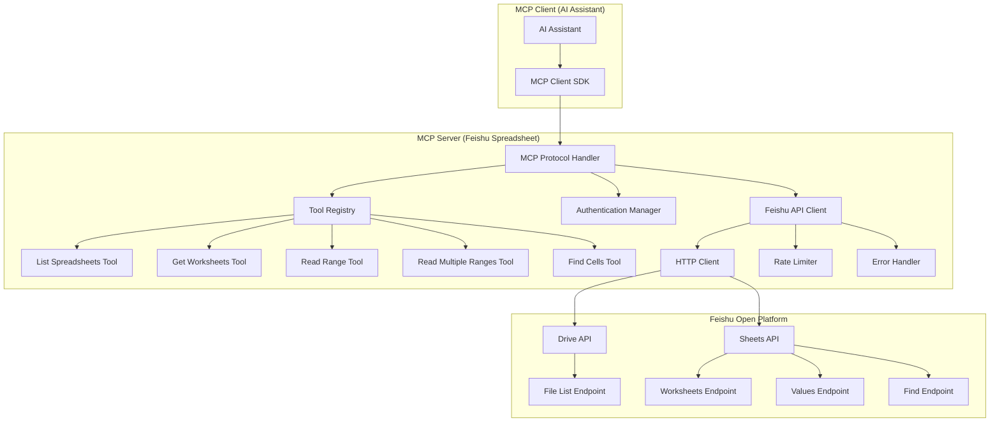

# Design Document

## Overview

本设计文档描述了飞书电子表格MCP服务的架构和实现方案。该服务基于Model Context Protocol (MCP)标准，作为一个独立的MCP服务器运行，通过飞书开放平台API提供电子表格数据访问能力。

MCP服务器将暴露一系列工具（tools），允许AI助手通过标准化的JSON-RPC 2.0协议调用这些工具来访问飞书电子表格数据。服务器支持认证管理、电子表格列表获取、工作表信息查询、数据范围读取和单元格查找等核心功能。

## Architecture

### 系统架构图



### 核心组件

1. **MCP Protocol Handler**: 处理JSON-RPC 2.0协议消息，管理工具调用和响应
2. **Tool Registry**: 注册和管理所有可用的工具
3. **Authentication Manager**: 管理飞书API认证和token刷新
4. **Feishu API Client**: 封装飞书API调用，处理HTTP请求和响应
5. **Rate Limiter**: 实现API调用频率限制和重试机制
6. **Error Handler**: 统一错误处理和错误码映射

## Components and Interfaces

### MCP Server Interface

```python
class FeishuSpreadsheetMCPServer:
    """飞书电子表格MCP服务器主类"""
    
    def __init__(self, app_id: str, app_secret: str):
        self.app_id = app_id
        self.app_secret = app_secret
        self.auth_manager = AuthenticationManager(app_id, app_secret)
        self.api_client = FeishuAPIClient(self.auth_manager)
        self.tool_registry = ToolRegistry()
        self._register_tools()
    
    async def handle_request(self, request: dict) -> dict:
        """处理MCP协议请求"""
        pass
    
    def _register_tools(self):
        """注册所有工具"""
        pass
```

### Tool Definitions

#### 1. List Spreadsheets Tool

```python
@tool
async def list_spreadsheets(
    folder_token: Optional[str] = None,
    page_size: int = 50
) -> List[SpreadsheetInfo]:
    """
    获取用户可访问的电子表格列表
    
    Args:
        folder_token: 文件夹token，为空时获取根目录
        page_size: 每页返回的数量，最大200
    
    Returns:
        电子表格信息列表
    """
```

#### 2. Get Worksheets Tool

```python
@tool
async def get_worksheets(
    spreadsheet_token: str
) -> List[WorksheetInfo]:
    """
    获取指定电子表格的工作表列表
    
    Args:
        spreadsheet_token: 电子表格token
    
    Returns:
        工作表信息列表
    """
```

#### 3. Read Range Tool

```python
@tool
async def read_range(
    spreadsheet_token: str,
    range_spec: str,
    value_render_option: str = "UnformattedValue",
    date_time_render_option: str = "FormattedString"
) -> RangeData:
    """
    读取指定范围的单元格数据
    
    Args:
        spreadsheet_token: 电子表格token
        range_spec: 范围规格，格式为 "sheetId!A1:B10"
        value_render_option: 数据渲染选项
        date_time_render_option: 日期时间渲染选项
    
    Returns:
        范围数据
    """
```

#### 4. Read Multiple Ranges Tool

```python
@tool
async def read_multiple_ranges(
    spreadsheet_token: str,
    ranges: List[str],
    value_render_option: str = "UnformattedValue",
    date_time_render_option: str = "FormattedString"
) -> List[RangeData]:
    """
    批量读取多个范围的数据
    
    Args:
        spreadsheet_token: 电子表格token
        ranges: 范围列表
        value_render_option: 数据渲染选项
        date_time_render_option: 日期时间渲染选项
    
    Returns:
        多个范围的数据列表
    """
```

#### 5. Find Cells Tool

```python
@tool
async def find_cells(
    spreadsheet_token: str,
    sheet_id: str,
    range_spec: str,
    find_text: str,
    match_case: bool = False,
    match_entire_cell: bool = False,
    search_by_regex: bool = False,
    include_formulas: bool = False
) -> FindResult:
    """
    在指定范围内查找单元格
    
    Args:
        spreadsheet_token: 电子表格token
        sheet_id: 工作表ID
        range_spec: 搜索范围
        find_text: 查找文本或正则表达式
        match_case: 是否区分大小写
        match_entire_cell: 是否完全匹配单元格
        search_by_regex: 是否使用正则表达式
        include_formulas: 是否仅搜索公式
    
    Returns:
        查找结果
    """
```

### Authentication Manager

```python
class AuthenticationManager:
    """飞书API认证管理器"""
    
    def __init__(self, app_id: str, app_secret: str):
        self.app_id = app_id
        self.app_secret = app_secret
        self.tenant_access_token = None
        self.token_expires_at = None
    
    async def get_tenant_access_token(self) -> str:
        """获取tenant_access_token"""
        if self._is_token_expired():
            await self._refresh_token()
        return self.tenant_access_token
    
    async def _refresh_token(self):
        """刷新访问令牌"""
        pass
    
    def _is_token_expired(self) -> bool:
        """检查token是否过期"""
        pass
```

### Feishu API Client

```python
class FeishuAPIClient:
    """飞书API客户端"""
    
    def __init__(self, auth_manager: AuthenticationManager):
        self.auth_manager = auth_manager
        self.rate_limiter = RateLimiter()
        self.error_handler = ErrorHandler()
    
    async def list_files(self, folder_token: Optional[str] = None, **kwargs) -> dict:
        """获取文件列表"""
        pass
    
    async def get_worksheets(self, spreadsheet_token: str) -> dict:
        """获取工作表列表"""
        pass
    
    async def read_range(self, spreadsheet_token: str, range_spec: str, **kwargs) -> dict:
        """读取单个范围"""
        pass
    
    async def read_multiple_ranges(self, spreadsheet_token: str, ranges: List[str], **kwargs) -> dict:
        """读取多个范围"""
        pass
    
    async def find_cells(self, spreadsheet_token: str, sheet_id: str, **kwargs) -> dict:
        """查找单元格"""
        pass
```

## Data Models

### 核心数据模型

```python
from dataclasses import dataclass
from typing import List, Optional, Any
from datetime import datetime

@dataclass
class SpreadsheetInfo:
    """电子表格信息"""
    token: str
    name: str
    type: str  # "sheet"
    url: str
    created_time: datetime
    modified_time: datetime
    owner_id: str

@dataclass
class WorksheetInfo:
    """工作表信息"""
    sheet_id: str
    title: str
    index: int
    hidden: bool
    row_count: int
    column_count: int
    frozen_row_count: int
    frozen_column_count: int
    resource_type: str
    merges: Optional[List[dict]] = None

@dataclass
class RangeData:
    """范围数据"""
    range: str
    major_dimension: str  # "ROWS"
    values: List[List[Any]]
    revision: int

@dataclass
class FindResult:
    """查找结果"""
    matched_cells: List[str]
    matched_formula_cells: List[str]
    rows_count: int

@dataclass
class MCPToolResult:
    """MCP工具调用结果"""
    content: List[dict]
    is_error: bool = False
```

### 错误模型

```python
@dataclass
class FeishuAPIError:
    """飞书API错误"""
    code: int
    message: str
    http_status: int
    
    def to_mcp_error(self) -> dict:
        """转换为MCP错误格式"""
        return {
            "content": [
                {
                    "type": "text",
                    "text": f"飞书API错误 {self.code}: {self.message}"
                }
            ],
            "isError": True
        }
```

## Error Handling

### 错误分类和处理策略

1. **认证错误 (401)**
   - 自动刷新token
   - 重试原请求
   - 失败后返回认证错误

2. **权限错误 (403, 1310213)**
   - 立即返回权限错误
   - 提供权限配置指导

3. **资源不存在 (404, 1310214, 1310215)**
   - 立即返回资源不存在错误
   - 不进行重试

4. **频率限制 (1310217)**
   - 实现指数退避重试
   - 最多重试3次

5. **临时错误 (1310235, 1310242)**
   - 延迟重试
   - 最多重试3次

6. **服务器错误 (1315201, 1315203)**
   - 立即返回错误
   - 提示联系客服

### 重试机制

```python
class RetryConfig:
    """重试配置"""
    max_retries: int = 3
    base_delay: float = 1.0
    max_delay: float = 60.0
    exponential_base: float = 2.0
    
    retryable_errors = {
        1310217,  # Too Many Request
        1310235,  # Retry Later
        1310242,  # In Mix state
    }
```

## Testing Strategy

### 单元测试

1. **工具函数测试**
   - 测试每个MCP工具的输入验证
   - 测试正常流程和异常流程
   - 模拟飞书API响应

2. **API客户端测试**
   - 测试HTTP请求构建
   - 测试响应解析
   - 测试错误处理

3. **认证管理器测试**
   - 测试token获取和刷新
   - 测试token过期检查

### 集成测试

1. **MCP协议测试**
   - 测试tools/list请求
   - 测试tools/call请求
   - 测试错误响应格式

2. **飞书API集成测试**
   - 使用测试账号和真实API
   - 测试各种边界条件
   - 测试错误场景

### 端到端测试

1. **完整工作流测试**
   - 从MCP客户端到飞书API的完整调用链
   - 测试多种数据格式和大小
   - 测试并发调用

2. **性能测试**
   - 测试API调用延迟
   - 测试并发处理能力
   - 测试内存使用情况

### 测试数据准备

1. **测试电子表格**
   - 创建包含各种数据类型的测试表格
   - 包含公式、合并单元格、格式化数据
   - 不同大小的数据集

2. **Mock数据**
   - 飞书API响应的mock数据
   - 各种错误场景的mock响应
   - 边界条件的测试数据

### 测试环境配置

1. **开发环境**
   - 使用飞书开放平台沙箱环境
   - 配置测试应用和权限

2. **CI/CD集成**
   - 自动化测试执行
   - 测试覆盖率报告
   - 性能基准测试